# Editable Visual Design

**Coding-agent-driven creation of editable, tastefully crafted visual artifacts.**

Editable Visual Design turns a prompt into a structured design artifact with real text, independent assets, semantic HTML layers, and a replayable creation process—instead of shipping a flattened image.

## Overview

<video src="https://github.com/user-attachments/assets/450b4471-784f-49be-89b2-fbf79361fc2c" width="100%" controls></video>

## Table of Contents

- [Overview](#overview)
- [Why Editable Visual Design](#why-editable-visual-design)
- [Three Core Ideas](#three-core-ideas)
- [Gallery](#gallery)
  - [🎯 Campaigns](#campaigns)
  - [📚 Information Design](#information-design)
  - [✍️ Text-led Design](#text-led-design)
  - [📰 Poster](#poster)
  - [🎨 Art Design](#art-design)
- [Quick Start](#quick-start)
- [Acknowledgements](#acknowledgements)

## Why Editable Visual Design

Image generation can quickly produce beautiful designs, but a local change often means regenerating the whole image. Direct coding provides structure, but its visual finish is inconsistent. Editable Visual Design combines visual direction and editable structure in one artifact.

| | Image generation | Direct coding | Editable Visual Design |
|---|---|---|---|
| Art-directed visual quality | Strong | Inconsistent | Strong |
| Real text and semantic layers | No | Yes | Yes |
| Local edits without regeneration | No | Yes | Yes |
| Replayable creation path | No | Partial | Yes |

## Three Core Ideas

### 1. Coding-Agent-Driven Design

One persistent Coding Agent owns the artifact from intent to repair: understanding the brief, planning the composition, generating assets, implementing HTML, rendering, observing, and fixing the result. Agent Design Replay makes that path visible and traceable.

### 2. Visual Prior, Without Pixel Shipping

An image model provides art direction—composition, hierarchy, color, and spatial relationships—but its reference pixels never enter the delivered design. The agent generates clean assets and rebuilds typography and layout in HTML.

### 3. Editable and Quality-Gated Artifacts

The result contains real text, semantic layers, and independent assets that can be selected, moved, edited, and exported. Deterministic checks cover the canvas, fonts, layer contracts, rendering, and editor round trips.

## Gallery

Seventeen prompts across five visual-design categories, with final renderings, editable demonstrations, and Agent Design Replays.

## Campaigns

### Nordic Chair

<table role="presentation" width="100%">
  <tr>
    <td width="33.96%" align="center" valign="top">
      <details open>
        <summary align="center"><strong>🖼️ final-coding-design.png</strong></summary>
        <a href="./gallery/campaigns/nordic-chair/final.png">
          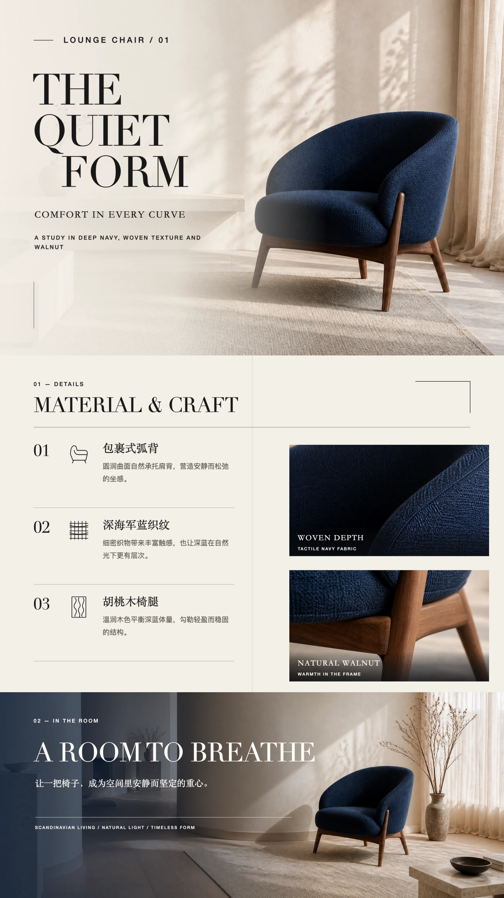
        </a>
      </details>
    </td>
    <td width="66.04%" align="center" valign="top">
      <video src="https://github.com/user-attachments/assets/f8a0a631-a5d1-4ee0-a058-bb8dead1f188" width="100%" controls></video>
    </td>
  </tr>
</table>

<video src="https://github.com/user-attachments/assets/550fdcdf-92a5-4717-8b26-63d04cb9a20d" width="100%" controls></video>

**Prompt:**

```text
设计一张高端北欧家具产品长图海报，主角为一把深海军蓝色织物休闲椅，圆润包裹式椅背，胡桃木椅腿。整体采用米白、暖灰与深蓝配色，温暖自然光，现代北欧客厅场景，精致家居杂志质感。海报包含：顶部大幅生活场景与品牌标题、中部产品卖点和极简线性图标、座椅面料与木质结构的细节特写、底部完整空间展示。留白充足，黑色优雅衬线字体，网格化排版，简约、温暖、高级、真实产品摄影，电商详情页风格，竖版 9:16，高清。
```

### 山柚观音

<table role="presentation" width="100%">
  <tr>
    <td width="38.39%" align="center" valign="top">
      <details open>
        <summary align="center"><strong>🖼️ final-coding-design.png</strong></summary>
        <a href="./gallery/campaigns/shanyou-guanyin-tea/final.png">
          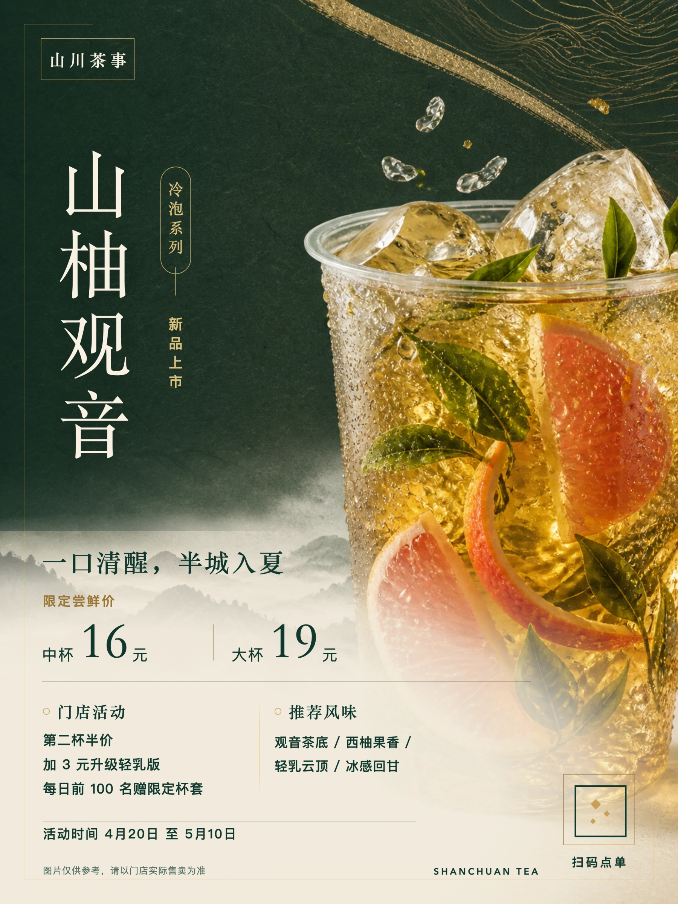
        </a>
      </details>
    </td>
    <td width="61.61%" align="center" valign="top">
      <video src="https://github.com/user-attachments/assets/bca30fb1-16c2-4e3a-b71d-3c7ee0c1df38" width="100%" controls></video>
    </td>
  </tr>
</table>

<video src="https://github.com/user-attachments/assets/0a5ff716-598f-404c-bdbc-dde572535462" width="100%" controls></video>

**Prompt:**

```text
Design a 3:4 vertical New Chinese light-luxury tea-launch poster in dark green, off-white, and gold, with rice-paper texture, restrained negative space, landscape accents, and modern layout. Hero: an appealing cold-brew tea with leaves, citrus, ice, and gold foil. Display exactly: "山川茶事" / "山柚观音" / "冷泡系列" / "新品上市"; "一口清醒，半城入夏" / "限定尝鲜价"; "中杯 16 元" / "大杯 19 元"; "门店活动" / "第二杯半价" / "加 3 元升级轻乳版" / "每日前 100 名赠限定杯套"; "推荐风味" / "观音茶底 / 西柚果香 / 轻乳云顶 / 冰感回甘"; "活动时间 4月20日 至 5月10日" / "扫码点单" / "SHANCHUAN TEA". Fine print: "图片仅供参考，请以门店实际售卖为准". Use clear promotional hierarchy, refined Chinese typography, and accurate small text, numbers, prices, and modules; avoid cheap e-commerce styling.
```

### KFC × 77

<table role="presentation" width="100%">
  <tr>
    <td width="33.98%" align="center" valign="top">
      <details open>
        <summary align="center"><strong>🖼️ final-coding-design.png</strong></summary>
        <a href="./gallery/campaigns/kfc-77/final.png">
          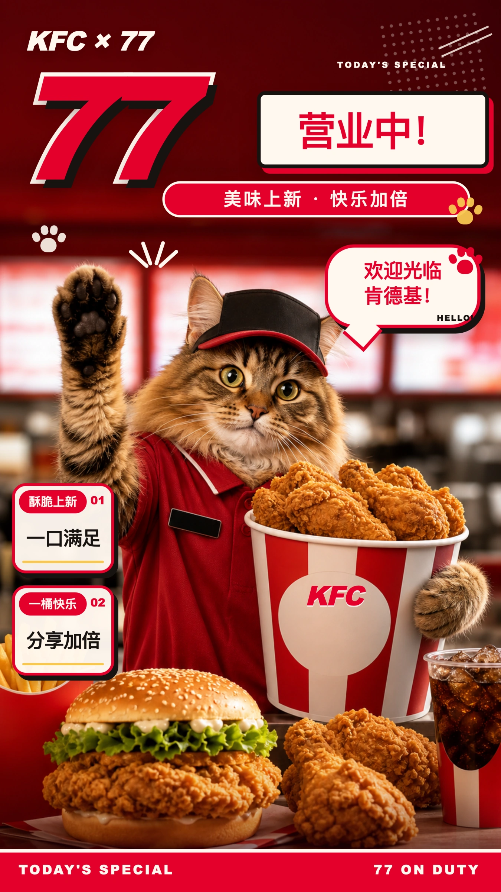
        </a>
      </details>
    </td>
    <td width="66.02%" align="center" valign="top">
      <video src="https://github.com/user-attachments/assets/ce2a83ef-a274-4325-a3b8-097d75c1daef" width="100%" controls></video>
    </td>
  </tr>
</table>

<video src="https://github.com/user-attachments/assets/dd7b5f4d-f024-4081-a585-19f15377c2a1" width="100%" controls></video>

**Prompt:**

```text
生成一张高质量的 9:16 竖版 KFC 联名宣传海报。
画面中央是一只真实可爱的长毛猫，穿着红色 KFC 员工制服和黑红色工作帽，站在餐厅收银台前，一只爪子抬起打招呼，另一只爪子抱着装满炸鸡的 KFC 欢乐桶。前景摆放炸鸡汉堡、薯条、炸鸡、可乐等套餐，背景是轻微虚化的 KFC 点餐屏和餐厅环境。
顶部放置“KFC × 77”，主标题为“77 营业中！”，副标题为“美味上新 · 快乐加倍”。加入少量圆角推荐卡片、猫爪图标和对话框“欢迎光临肯德基！”
```

<details>
<summary><strong>Show full prompt</strong></summary>

```text
生成一张高质量的 9:16 竖版 KFC 联名宣传海报。

画面中央是一只真实可爱的长毛猫，穿着红色 KFC 员工制服和黑红色工作帽，站在餐厅收银台前，一只爪子抬起打招呼，另一只爪子抱着装满炸鸡的 KFC 欢乐桶。前景摆放炸鸡汉堡、薯条、炸鸡、可乐等套餐，背景是轻微虚化的 KFC 点餐屏和餐厅环境。

顶部放置“KFC × 77”，主标题为“77 营业中！”，副标题为“美味上新 · 快乐加倍”。加入少量圆角推荐卡片、猫爪图标和对话框“欢迎光临肯德基！”

整体使用经典红白配色，商业摄影质感，活泼可爱，信息层级清晰，中文字体醒目，食物诱人，版面丰富但不杂乱。保持猫咪外形自然，不要卡通化，不要多余人物或错误文字。
```

</details>

### 澄光维稳精华

<table role="presentation" width="100%">
  <tr>
    <td width="38.94%" align="center" valign="top">
      <details open>
        <summary align="center"><strong>🖼️ final-coding-design.png</strong></summary>
        <a href="./gallery/campaigns/chengguang-serum/final.png">
          
        </a>
      </details>
    </td>
    <td width="61.06%" align="center" valign="top">
      <video src="https://github.com/user-attachments/assets/aeac388b-ee86-45b5-8cb7-0cc78c3c3842" width="100%" controls></video>
    </td>
  </tr>
</table>

<video src="https://github.com/user-attachments/assets/cc2c9d7f-6187-424b-8113-a6339773446f" width="100%" controls></video>

**Prompt:**

```text
Create a high-end skincare e-commerce hero poster for "澄光维稳精华" ("Clarifying Stabilizing Essence"). The style should be clean, light-luxury, and strongly science-skincare oriented. In the center, place a semi-transparent frosted-glass essence bottle filled with golden liquid and subtle water-droplet reflections. Use an off-white to warm gray gradient background with liquid-flow elements and microscopic molecular-structure decoration.
The poster must include the following exact Chinese copy:
"澄光"
```

<details>
<summary><strong>Show full prompt</strong></summary>

```text
Create a high-end skincare e-commerce hero poster for "澄光维稳精华" ("Clarifying Stabilizing Essence"). The style should be clean, light-luxury, and strongly science-skincare oriented. In the center, place a semi-transparent frosted-glass essence bottle filled with golden liquid and subtle water-droplet reflections. Use an off-white to warm gray gradient background with liquid-flow elements and microscopic molecular-structure decoration.

The poster must include the following exact Chinese copy:
"澄光"
"维稳精华"
"修护屏障"
"舒缓泛红"
"细腻透亮"
"第 2 代升级配方"
"核心成分"
"神经酰胺"
"泛醇 B5"
"积雪草提取物"
"微囊脂质体"
"适合人群"
"敏感肌"
"熬夜肌"
"换季不稳定肌"
"限时到手价 229 元"
"买 1 送 3"
"赠洁面 15ml"
"赠精华 5ml"
"赠面霜 10g"

Fine print:
"实际效果因人而异，请坚持使用"

Focus on product selling points, pricing hierarchy, gift-list modules, product naming, and short functional phrases. The result should feel premium and not tacky or overly live-commerce styled.
```

</details>

---

## Information Design

### Red Panda Field Guide

<table role="presentation" width="100%">
  <tr>
    <td width="37.36%" align="center" valign="top">
      <details open>
        <summary align="center"><strong>🖼️ final-coding-design.png</strong></summary>
        <a href="./gallery/information-design/red-panda-field-guide/final.png">
          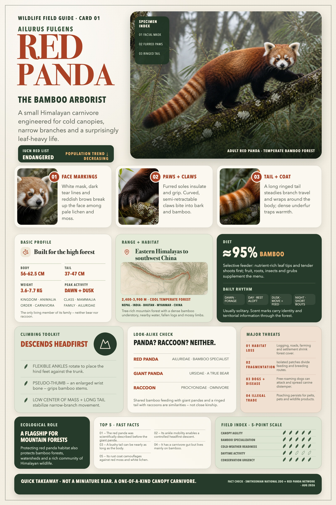
        </a>
      </details>
    </td>
    <td width="62.64%" align="center" valign="top">
      <video src="https://github.com/user-attachments/assets/baf59bed-a801-470b-85c6-5082af48cea2" width="100%" controls></video>
    </td>
  </tr>
</table>

<video src="https://github.com/user-attachments/assets/b668a929-563d-456f-848b-08b275de3a42" width="100%" controls></video>

**Prompt:**

```text
Generate a high-quality vertical encyclopedia-style infographic about the red panda.
This should not be a normal animal poster or a simple illustration. It should feel like a modular wildlife field guide that combines the clarity of an encyclopedia page, the polish of a lifestyle knowledge card, and the shareability of a strong social-media explainer.
The image should include:
```

<details>
<summary><strong>Show full prompt</strong></summary>

```text
Generate a high-quality vertical encyclopedia-style infographic about the red panda.

This should not be a normal animal poster or a simple illustration. It should feel like a modular wildlife field guide that combines the clarity of an encyclopedia page, the polish of a lifestyle knowledge card, and the shareability of a strong social-media explainer.

The image should include:
- a clear and appealing main visual of an anatomically accurate red panda in its natural forest habitat
- several enlarged detail callouts showing features such as its ringed tail, facial markings, paws, claws, and thick fur
- multiple rounded modular information sections
- strong title hierarchy and highlighted key labels
- concise but information-rich educational content
- visual scoring, quick takeaways, or a Top 5 facts module

Adapt the content sections to the red panda. Useful categories include:
basic profile, scientific classification, physical appearance, habitat and geographic distribution, diet, daily behavior, climbing adaptations, ecological role, differences from giant pandas and raccoons, conservation status, major threats, and a quick field-guide scorecard.

Visual requirements:
use a clean light background, soft forest-inspired colors, subtle shadows, refined wildlife icons, rounded information cards, and a neat editorial layout. The information density should be high but not crowded, and the final image should feel publishable, collectible, and repeatable as part of a wildlife knowledge-card series rather than an advertisement.

Do not make it look like a commercial zoo poster or an overly cute cartoon. Emphasize accurate wildlife representation, knowledge organization, modular information, and a natural-history field-guide presentation.
```

</details>

### NYC 3-Day Guide

<table role="presentation" width="100%">
  <tr>
    <td width="37.36%" align="center" valign="top">
      <details open>
        <summary align="center"><strong>🖼️ final-coding-design.png</strong></summary>
        <a href="./gallery/information-design/nyc-3-day-guide/final.png">
          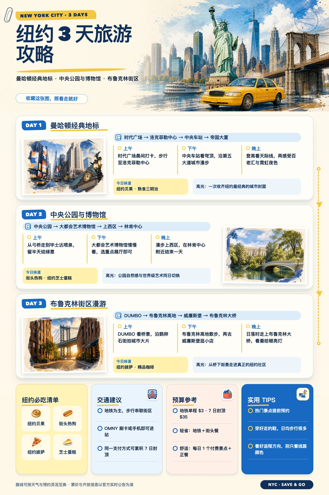
        </a>
      </details>
    </td>
    <td width="62.64%" align="center" valign="top">
      <video src="https://github.com/user-attachments/assets/0bc87feb-f939-4cea-b63d-d5d4e1143474" width="100%" controls></video>
    </td>
  </tr>
</table>

<video src="https://github.com/user-attachments/assets/13419bcf-1eb4-4b7a-bd6b-70cdc9290d0b" width="100%" controls></video>

**Prompt:**

```text
Create a vertical editorial travel infographic poster titled “纽约3天旅游攻略,” using a warm ivory paper background with navy blue, sky blue and taxi yellow accents. Divide the composition into four clear sections: a large top hero area with bold Chinese typography on the left and a watercolor-photo collage of the New York skyline, Statue of Liberty, Brooklyn Bridge, ferry and yellow taxi on the right; three stacked rounded itinerary cards for DAY 1 Manhattan landmarks, DAY 2 Central Park and museums, and DAY 3 Brooklyn and DUMBO; and a compact bottom row containing four practical cards for local food, transportation, budget and travel tips. Each daily card should include one framed watercolor city image, a pale-blue route bar, three columns labeled morning, afternoon and evening, yellow divider lines, a small food recommendation and a highlighted travel note. Alternate the image position between left and right to create rhythm, and connect the three days with a dotted yellow itinerary line along the outer edge. Use a clean modular grid, generous margins, subtle shadows, rounded corners, small friendly icons and strong typographic hierarchy. Blend polished tourism-guide design with hand-painted watercolor textures, torn brush edges and light paper grain; informative, cheerful, organized and easy to scan.
```

### Abs Training Plan

<table role="presentation" width="100%">
  <tr>
    <td width="39.36%" align="center" valign="top">
      <details open>
        <summary align="center"><strong>🖼️ final-coding-design.png</strong></summary>
        <a href="./gallery/information-design/abs-training-plan/final.png">
          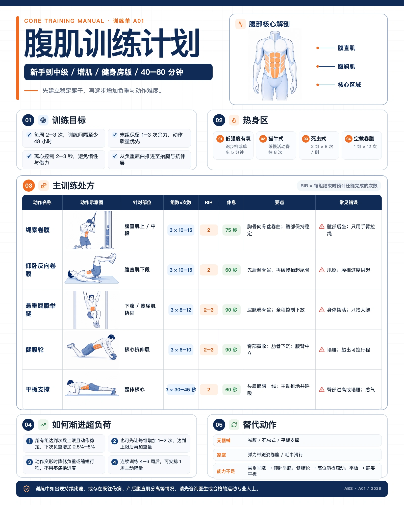
        </a>
      </details>
    </td>
    <td width="60.64%" align="center" valign="top">
      <video src="https://github.com/user-attachments/assets/b382f8c6-fe11-4fb4-b6af-17a14e2cc973" width="100%" controls></video>
    </td>
  </tr>
</table>

<video src="https://github.com/user-attachments/assets/498323b1-6079-4cb5-952a-c8a1e574252b" width="100%" controls></video>

**Prompt:**

```text
生成一张竖版（4:5）中文健身信息图海报，主题「腹肌训练计划」。
风格：教学手册式信息图，白底，深蓝 + 橙色双主色，圆角白卡片配细边框，无衬线黑体，
信息密度高但排版整齐对齐。
```

<details>
<summary><strong>Show full prompt</strong></summary>

```text
生成一张竖版（4:5）中文健身信息图海报，主题「腹肌训练计划」。

风格：教学手册式信息图，白底，深蓝 + 橙色双主色，圆角白卡片配细边框，无衬线黑体，
信息密度高但排版整齐对齐。

结构：

1. 顶部：大号加粗标题「腹肌训练计划」+ 深蓝标签条副标题「新手到中级 / 增肌 / 健身房版 / 40-60 分钟」；
   右侧腹部肌肉解剖图，引线标注腹直肌、腹斜肌、核心区域。
2. 左右两栏卡片：① 训练目标  ② 热身区（编号步骤）。
3. 主训练表格（通栏）：动作名称 | 动作示意图 | 针对部位 | 组数×次数 | RIR | 休息 | 要点 | 常见错误。
   5 个动作：绳索卷腹、仰卧反向卷腹、悬垂屈膝举腿、健腹轮、平板支撑。
   组数用浅蓝标签、RIR 浅橙、休息绿色，常见错误配红色警告图标。
4. 底部两栏：④ 如何渐进超负荷  ⑤ 替代动作（无器械 / 家庭 / 能力不足）。

每个分区带圆形编号徽标和图标；文字全部为真实可读的简体中文，禁止乱码或占位文本。
```

</details>

---

## Text-led Design

### 滕王阁序

<table role="presentation" width="100%">
  <tr>
    <td width="33.74%" align="center" valign="top">
      <details open>
        <summary align="center"><strong>🖼️ final-coding-design.png</strong></summary>
        <a href="./gallery/text-led-design/tengwang-ge-xu/final.png">
          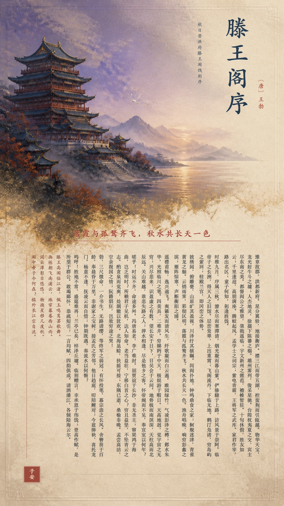
        </a>
      </details>
    </td>
    <td width="66.26%" align="center" valign="top">
      <video src="https://github.com/user-attachments/assets/cadf7ba0-70ee-48e8-b7ae-2744718595f7" width="100%" controls></video>
    </td>
  </tr>
</table>

<video src="https://github.com/user-attachments/assets/3e111f6a-a157-4afd-a5b7-8eedc2495561" width="100%" controls></video>

**Prompt:**

```text
生成包含完整的滕王阁序的海报
```

### AI Team Love Letter

<table role="presentation" width="100%">
  <tr>
    <td width="36.52%" align="center" valign="top">
      <details open>
        <summary align="center"><strong>🖼️ final-coding-design.png</strong></summary>
        <a href="./gallery/text-led-design/ai-team-love-letter/final.png">
          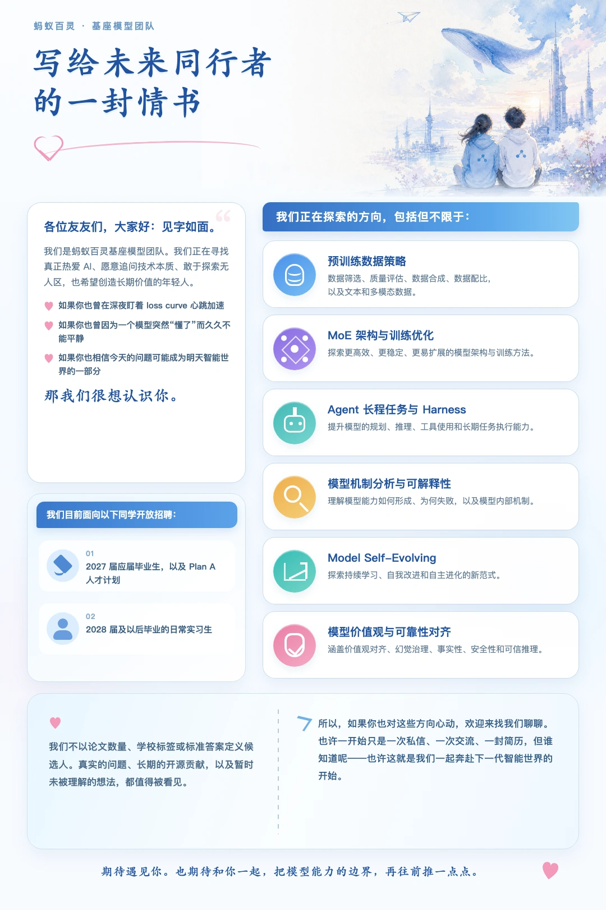
        </a>
      </details>
    </td>
    <td width="63.48%" align="center" valign="top">
      <video src="https://github.com/user-attachments/assets/96652414-3197-4aba-aae8-21962ace69ce" width="100%" controls></video>
    </td>
  </tr>
</table>

<video src="https://github.com/user-attachments/assets/c7bd45be-3489-4b3b-8694-e588a3ba8d42" width="100%" controls></video>

**Prompt:**

```text
请设计一张 2:3 竖版中文 AI 团队招聘长图海报，尺寸 1080×1620 px。
【设计主题】
“写给未来同行者的一封情书”
```

<details>
<summary><strong>Show full prompt</strong></summary>

```text
请设计一张 2:3 竖版中文 AI 团队招聘长图海报，尺寸 1080×1620 px。

【设计主题】
“写给未来同行者的一封情书”
整体不是传统企业招聘广告，而是一封温柔、真诚、富有理想主义的邀请信。画面应同时具有科技感、青春感、未来感和人情味。

【视觉风格】
采用清新高级的蓝白色系，搭配少量粉色、紫色、青绿色和暖黄色点缀；将柔和水彩插画与现代科技信息图表相结合。留白充足，整体轻盈通透。使用圆角白色卡片、浅蓝色阴影、蓝紫渐变丝带和圆形彩色图标。避免过度商业化、廉价科技蓝、强烈企业宣传感以及拥挤杂乱的排版。

【顶部主视觉】
顶部约占画面高度的 20%。左侧使用蓝色手写书法字体显示大标题：“写给未来同行者的一封情书”标题旁加入粉色爱心曲线、纸飞机或风筝元素。右侧绘制梦幻未来城市、高塔、云层和一只飞翔在天空中的蓝色鲸鱼。画面前景是两位并肩坐着、眺望城市的年轻人，采用背影构图。人物穿着带有抽象 AI 图形标志的连帽衫，不出现任何真实企业名称、品牌 Logo 或商业标识，营造“共同奔赴未来”的感觉。

【主体布局】
采用清晰的左右双栏排版，左栏约占 40%，右栏约占 60%。左栏是一封招聘情书。开头文字：“各位友友们，大家好：
见字如面。”

正文内容：
“我们是一支专注于基座模型研究与探索的 AI 团队。
我们希望寻找真正热爱 AI、愿意追问技术本质、敢于探索无人区，也希望创造长期价值的年轻人。”

中间使用三个粉色爱心作为项目符号，突出以下内容：
“如果你也曾在深夜盯着 loss curve 心跳加速”
“如果你也曾因为一个模型突然‘懂了’而久久不能平静”
“如果你也相信今天的问题，可能成为明天智能世界的一部分”

随后使用蓝色手写字体强调：
“那我们很想认识你。”

【招聘对象】
左栏下方设置圆角招聘信息框，顶部使用蓝色渐变丝带标题：
“我们目前面向以下同学开放招聘：”
框内包含两项：
1. 2027 届应届毕业生
2. 2028 届及以后毕业的日常实习生
两项分别搭配毕业帽图标和年轻人物图标。

【探索方向】
右栏顶部设置蓝色渐变丝带标题：
“我们正在探索的方向，包括但不限于：”
下方纵向排列 6 张白色圆角信息卡。每张卡片左侧为彩色圆形图标，右侧为标题和简短说明。

1. 预训练数据策略
使用蓝色数据库图标。说明文字：
“探索数据筛选、质量评估、数据合成、数据配比，以及文本和多模态数据。”

2. MoE 架构与训练优化
使用紫色神经网络图标。说明文字：
“探索更高效、更稳定、更易扩展的模型架构与训练方法。”

3. Agent 长程任务与 Harness
使用青绿色机器人图标。说明文字：
“提升模型的规划、推理、工具使用和长期任务执行能力。”

4. 模型机制分析与可解释性
使用橙黄色放大镜图标。说明文字：
“理解模型能力如何形成、为何失败，以及模型内部的运行机制。”

5. Model Self-Evolving
使用青绿色上升趋势图标。说明文字：
“探索持续学习、自我改进和自主进化的新范式。”

6. 模型价值观与可靠性对齐
使用粉红色盾牌图标。说明文字：
“涵盖价值观对齐、幻觉治理、事实性、安全性和可信推理。”

【底部区域】
设置一个横跨页面的浅色大圆角引用框。引用框采用左右分栏布局，中间使用浅灰蓝色虚线分隔。左侧文字：“我们不以论文数量、学校标签或标准答案定义候选人。真实的问题、长期的开源贡献，以及那些暂时未被理解的想法，都值得被看见。”右侧加入浅蓝色纸飞机图标，并写：“所以，如果你也对这些方向心动，欢迎来找我们聊聊。也许一开始只是一次私信、一次交流、一封简历，但谁知道呢——也许这就是我们一起奔赴下一代智能世界的开始。”

底部居中放置蓝色结束语：
“期待遇见你。也期待和你一起，把模型能力的边界，再往前推一点点。”
末尾增加一颗粉色爱心。
```

</details>

### Nebula AI Recruitment

<table role="presentation" width="100%">
  <tr>
    <td width="33.76%" align="center" valign="top">
      <details open>
        <summary align="center"><strong>🖼️ final-coding-design.png</strong></summary>
        <a href="./gallery/text-led-design/nebula-ai-recruitment/final.png">
          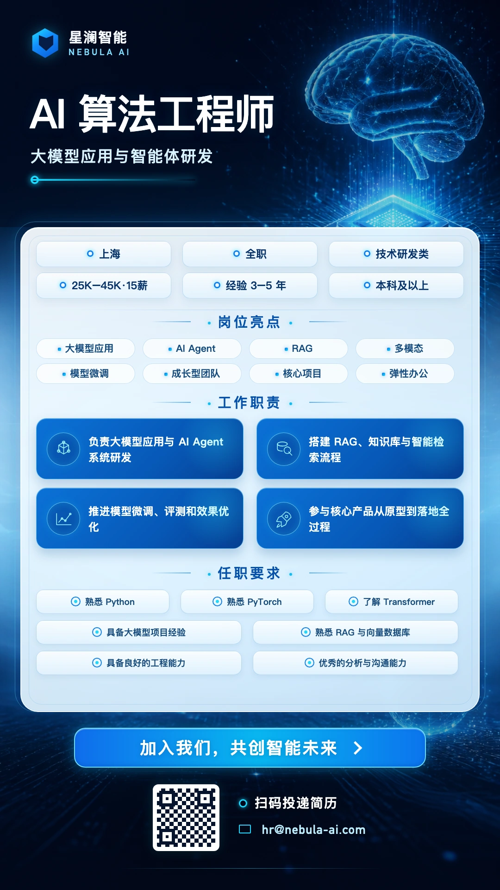
        </a>
      </details>
    </td>
    <td width="66.24%" align="center" valign="top">
      <video src="https://github.com/user-attachments/assets/5544a806-794e-4061-8a1d-5e1a69ad4b0c" width="100%" controls></video>
    </td>
  </tr>
</table>

<video src="https://github.com/user-attachments/assets/cd56776f-5253-46d3-8a22-1c4337fe00fc" width="100%" controls></video>

**Prompt:**

```text
设计一张专业的科技公司招聘信息长海报。
【画布】
尺寸为 1080×1920px，9:16 手机竖版，适合朋友圈、小红书和招聘社群发布。整体为高完成度的商业招聘海报，不是简单的信息表格。
```

<details>
<summary><strong>Show full prompt</strong></summary>

```text
设计一张专业的科技公司招聘信息长海报。

【画布】
尺寸为 1080×1920px，9:16 手机竖版，适合朋友圈、小红书和招聘社群发布。整体为高完成度的商业招聘海报，不是简单的信息表格。

【品牌与岗位】
公司名称：星澜智能
英文名称：NEBULA AI
招聘岗位：AI 算法工程师
岗位方向：大模型应用与智能体研发

【视觉风格】
采用深海军蓝到科技蓝的渐变背景，搭配青蓝色霓虹光效、数据网络、粒子连线、抽象 AI 芯片和数字大脑元素。整体风格专业、前沿、可信、有大型科技公司的视觉质感。避免过度炫光，保证文字清晰易读。

顶部背景较深，中部使用半透明浅蓝白色卡片承载信息，卡片带有轻微玻璃拟态效果、圆角和柔和阴影。底部回到深蓝色科技场景，形成完整的视觉收尾。

【版式结构】
严格按照以下顺序，自上而下排版：

1. 顶部品牌区
左上角放置简洁的蓝色几何科技 Logo，旁边显示：
“星澜智能”
“NEBULA AI”

2. 主标题区
使用大号粗体白字突出：
“AI 算法工程师”

副标题：
“大模型应用与智能体研发”

主标题醒目，占据顶部视觉中心，文字不得被装饰元素遮挡。

3. 岗位基本信息卡片
使用标签和圆角信息框展示：
“上海”
“全职”
“技术研发类”
“25K–45K·15薪”
“经验 3–5 年”
“本科及以上”

4. 岗位亮点
标题：“岗位亮点”

使用标签形式展示：
“大模型应用”
“AI Agent”
“RAG”
“多模态”
“模型微调”
“成长型团队”
“核心项目”
“弹性办公”

5. 工作职责
标题：“工作职责”

采用四个蓝色渐变功能卡片，两列排版，每张卡片带简洁线性图标：

“负责大模型应用与 AI Agent 系统研发”
“搭建 RAG、知识库与智能检索流程”
“推进模型微调、评测和效果优化”
“参与核心产品从原型到落地全过程”

6. 任职要求
标题：“任职要求”

使用浅色圆角标签展示：
“熟悉 Python”
“熟悉 PyTorch”
“了解 Transformer”
“具备大模型项目经验”
“熟悉 RAG 与向量数据库”
“具备良好的工程能力”
“优秀的分析与沟通能力”

7. 底部行动区
使用醒目的蓝色渐变按钮展示：
“加入我们，共创智能未来”

下方放置二维码占位框，并标注：
“扫码投递简历”
“hr@nebula-ai.com”
```

</details>

### Summer Music

<table role="presentation" width="100%">
  <tr>
    <td width="36.24%" align="center" valign="top">
      <details open>
        <summary align="center"><strong>🖼️ final-coding-design.png</strong></summary>
        <a href="./gallery/text-led-design/summer-music/final.png">
          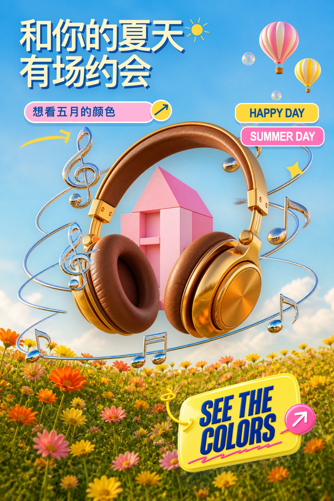
        </a>
      </details>
    </td>
    <td width="63.76%" align="center" valign="top">
      <video src="https://github.com/user-attachments/assets/21e4f9a3-bf59-4a20-a068-cff533daeb8b" width="100%" controls></video>
    </td>
  </tr>
</table>

<video src="https://github.com/user-attachments/assets/60c6d213-0158-46fc-8e0b-dbc9d3550835" width="100%" controls></video>

**Prompt:**

```text
Create a 2:3 vertical summer music poster with a bright, dreamy, and playful 3D look. Place a floating pair of gold-and-tan headphones in the center, with a pink geometric house behind them and silver lines and musical notes swirling around the scene. Fill the lower area with green grass and orange, yellow, and pink flowers, while adding a hot-air balloon, bubbles, and yellow doodles to the blue sky. Include the text “HAPPY DAY,” “SUMMER DAY,” “SEE THE COLORS,” “和你的夏天 有场约会,” and “想看五月的颜色,” using sky blue, bright yellow, pink, and green as the main colors.
```

---

## Poster

### E-Design

<table role="presentation" width="100%">
  <tr>
    <td width="35.90%" align="center" valign="top">
      <details open>
        <summary align="center"><strong>🖼️ final-coding-design.png</strong></summary>
        <a href="./gallery/poster/e-design/final.png">
          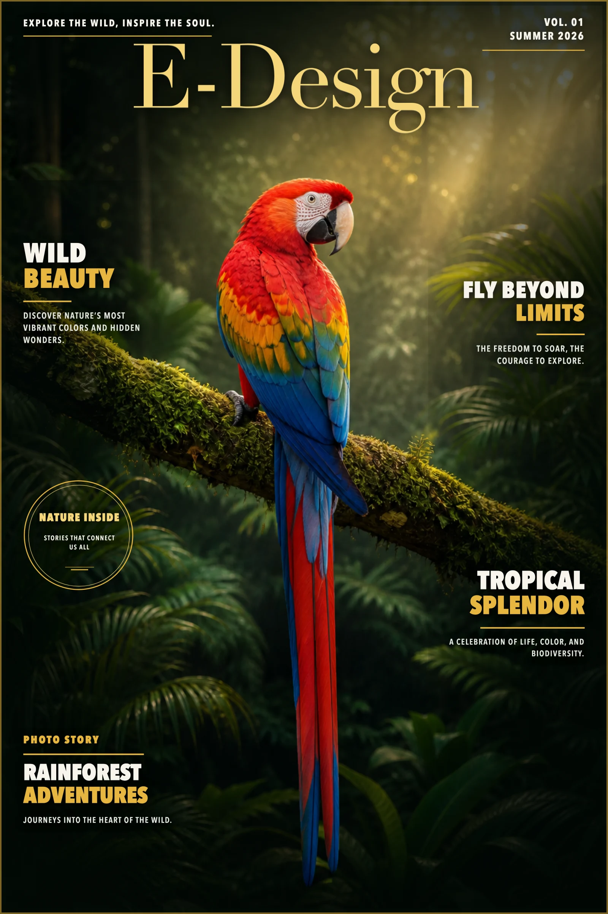
        </a>
      </details>
    </td>
    <td width="64.10%" align="center" valign="top">
      <video src="https://github.com/user-attachments/assets/246ea59e-93a8-4c3d-a5ba-bf57f8388cdb" width="100%" controls></video>
    </td>
  </tr>
</table>

<video src="https://github.com/user-attachments/assets/8d9fe755-d699-4cd1-ae33-cde6e1a5bc6e" width="100%" controls></video>

**Prompt:**

```text
生成一张竖版 2:3 的高端自然探索杂志封面，写实摄影风格。
画面主体是一只色彩艳丽的猩红金刚鹦鹉，完整全身，停在一根覆盖青苔的粗树枝上。鹦鹉位于画面中央偏下，身体呈优雅的三分之四侧面，头转向右侧，长尾羽自然延伸至画面底部。羽毛由鲜红、橙黄、金黄、青绿和深蓝组成，层次丰富，羽毛纹理极其清晰，眼睛、鸟喙和爪子结构真实准确。
背景是茂密幽深的热带雨林，深墨绿色植物与巨大棕榈叶环绕画面，右上方的金色阳光穿过树冠，形成明显的丁达尔光束、薄雾和自然散景，整体具有电影感、神秘感和高级自然杂志摄影质感。色调以深森林绿、金黄色和鹦鹉的高饱和红蓝色为主。
```

<details>
<summary><strong>Show full prompt</strong></summary>

```text
生成一张竖版 2:3 的高端自然探索杂志封面，写实摄影风格。

画面主体是一只色彩艳丽的猩红金刚鹦鹉，完整全身，停在一根覆盖青苔的粗树枝上。鹦鹉位于画面中央偏下，身体呈优雅的三分之四侧面，头转向右侧，长尾羽自然延伸至画面底部。羽毛由鲜红、橙黄、金黄、青绿和深蓝组成，层次丰富，羽毛纹理极其清晰，眼睛、鸟喙和爪子结构真实准确。

背景是茂密幽深的热带雨林，深墨绿色植物与巨大棕榈叶环绕画面，右上方的金色阳光穿过树冠，形成明显的丁达尔光束、薄雾和自然散景，整体具有电影感、神秘感和高级自然杂志摄影质感。色调以深森林绿、金黄色和鹦鹉的高饱和红蓝色为主。

画面必须具有清晰的空间分层：第一层是高清锐利的鹦鹉与青苔树枝，主体轮廓完整、羽毛边缘清楚，方便后期抠图；第二层是稍微虚化的中景雨林植物；第三层是柔焦的森林深处、雾气与阳光。鹦鹉与背景之间具有明显的景深分离和暖色轮廓光，不要让背景树叶与鹦鹉羽毛粘连。

采用高级时尚杂志封面排版。顶部放置超大的金黄色高对比衬线体标题“E-design”，横跨画面宽度；左上角放置小字“EXPLORE THE WILD, INSPIRE THE SOUL.”；右上角排版“VOL. 01”和“SUMMER 2026”。

左侧中部排版：
“WILD”
“BEAUTY”
“DISCOVER NATURE’S MOST VIBRANT COLORS AND HIDDEN WONDERS.”

右侧中部排版：
“FLY BEYOND”
“LIMITS”
“THE FREEDOM TO SOAR, THE COURAGE TO EXPLORE.”

左侧下方加入细线圆形徽章，文字：
“NATURE INSIDE”
“STORIES THAT CONNECT US ALL”

右侧下方排版：
“TROPICAL”
“SPLENDOR”
“A CELEBRATION OF LIFE, COLOR, AND BIODIVERSITY.”

左下角排版：
“PHOTO STORY”
“RAINFOREST ADVENTURES”
“JOURNEYS INTO THE HEART OF THE WILD.”

栏目标题使用粗窄体无衬线字体，白色与金黄色交替；正文使用清晰简洁的白色无衬线字体；搭配细金色分隔线。排版专业、紧凑、有呼吸感，所有文字避开鹦鹉的眼睛、鸟喙和主体轮廓。

超写实自然摄影，电影级光影，精细羽毛，真实植物纹理，高级杂志印刷质感，视觉焦点明确，构图平衡，4K细节。
```

</details>

### Chongqing Rain Night

<table role="presentation" width="100%">
  <tr>
    <td width="38.44%" align="center" valign="top">
      <details open>
        <summary align="center"><strong>🖼️ final-coding-design.png</strong></summary>
        <a href="./gallery/poster/chongqing-rain-night/final.png">
          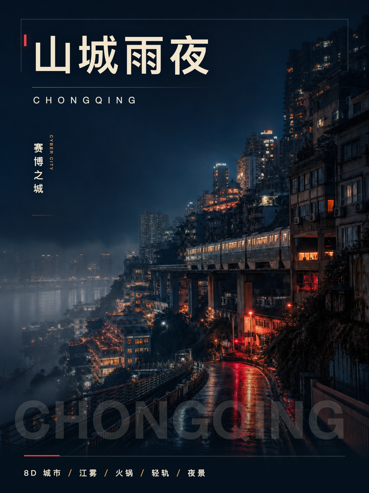
        </a>
      </details>
    </td>
    <td width="61.56%" align="center" valign="top">
      <video src="https://github.com/user-attachments/assets/5f37a612-882d-4800-9fb9-1b6d394e06a1" width="100%" controls></video>
    </td>
  </tr>
</table>

<video src="https://github.com/user-attachments/assets/22167f4d-7e6f-4605-aac9-3351359e8652" width="100%" controls></video>

**Prompt:**

```text
做一张 3:4 高端城市文旅 campaign 海报，主题“山城雨夜·重庆”。中心呈现层叠山城建筑、轻轨穿楼、湿润街道、霓虹倒影、江雾和夜色坡道。现代中文排版，准确加入：“山城雨夜” / “CHONGQING” / “8D 城市 / 江雾 / 火锅 / 轻轨 / 夜景”；在主标题下方的左侧江雾留白区域，加入竖排小字“赛博之城”，辅以更小的英文“CYBER CITY”。信息适中、留白克制，以深蓝、暖橙、湿润霓虹红为主，呈现设计年鉴级城市品牌感，避免廉价旅行社风。
```

### Beijing Winter Atlas

<table role="presentation" width="100%">
  <tr>
    <td width="38.44%" align="center" valign="top">
      <details open>
        <summary align="center"><strong>🖼️ final-coding-design.png</strong></summary>
        <a href="./gallery/poster/beijing-winter-atlas/final.png">
          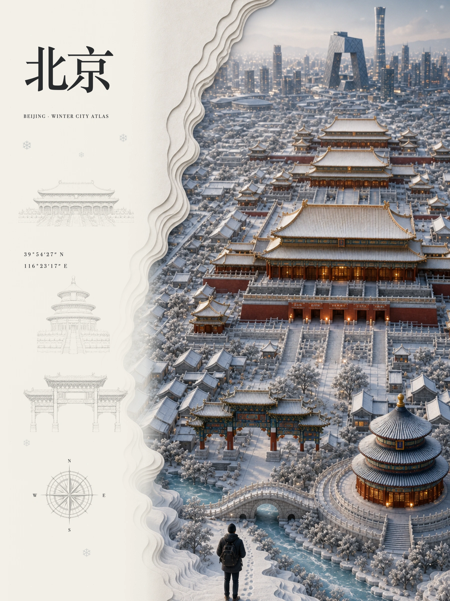
        </a>
      </details>
    </td>
    <td width="61.56%" align="center" valign="top">
      <video src="https://github.com/user-attachments/assets/76a5e235-8683-4065-a016-ba936a25bfee" width="100%" controls></video>
    </td>
  </tr>
</table>

<video src="https://github.com/user-attachments/assets/9db04a2f-447c-4438-9c23-d6839bb8cdbc" width="100%" controls></video>

**Prompt:**

```text
生成一张3:4竖版《北京冬季城市图鉴》旅行海报：左侧约三分之一为米白色留白信息栏，顶部以古典宋体写大标题“北京”，下方写“BEIJING · WINTER CITY ATLAS”，搭配少量雪花、地标线稿、坐标和罗盘；右侧约三分之二是一座从右上延伸至底部中央的超精细北京雪景微缩沙盘，采用高位45度斜俯视角和层叠纸雕等高线边缘，中央偏右以红墙金顶、覆盖积雪的故宫为最大主体，右下为天坛，下半部包含彩绘牌楼、胡同院落、冰蓝色河道与拱桥，右上逐渐过渡到央视大楼、中国尊等现代CBD天际线；底部中央放置一名背对镜头、穿深色冬装并背着背包的独自行人，一串脚印沿雪路通向城市。整体为高级博物馆建筑模型、手工纸雕与电影级3D渲染结合的质感，以象牙白、银灰、冰蓝为主，朱红、青绿和暖金灯光点缀，安静、怀旧、梦幻且写实；避免卡通、塑料玩具感、满版城市、过度橙红、重复地标、乱码大字、水印、边框、翻页箭头和轮播圆点。
```

---

## Art Design

### Sky Archive

<table role="presentation" width="100%">
  <tr>
    <td width="39.40%" align="center" valign="top">
      <details open>
        <summary align="center"><strong>🖼️ final-coding-design.png</strong></summary>
        <a href="./gallery/art-design/sky-archive/final.png">
          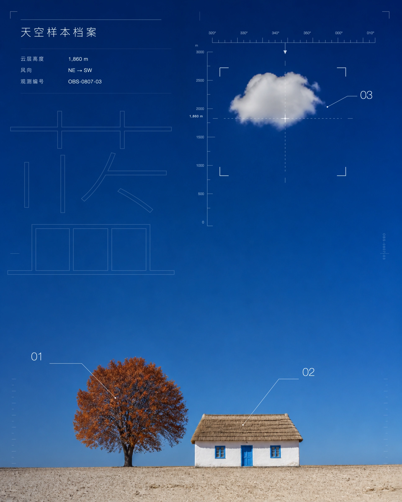
        </a>
      </details>
    </td>
    <td width="60.60%" align="center" valign="top">
      <video src="https://github.com/user-attachments/assets/c7592c82-cf46-4305-a0e8-ae98968a3fc5" width="100%" controls></video>
    </td>
  </tr>
</table>

<video src="https://github.com/user-attachments/assets/9c08b0ef-d193-4975-b967-a3354b972a09" width="100%" controls></video>

**Prompt:**

```text
Create a vertical 4:5 minimalist photographic poster for a fictional meteorological archive. A deep blue sky fills about 80% of the frame, with one isolated white cloud in the upper right; at the bottom, place a rust-orange autumn tree beside a small white thatched-roof house with blue doors and windows on pale sandy ground. Add an enormous transparent outline character “蓝” across the open sky and the title “天空样本档案” in the upper left. Frame the cloud with ultra-thin white coordinate lines, grid marks, crosshairs and labels: “云层高度 1,860 m”, “风向 NE → SW”, and “观测编号 OBS-0807-03”. Label the tree “01”, house “02”, and cloud “03” with precise leader lines. Include subtle degree and altitude scales, small archival data blocks, thin technical typography, Swiss scientific editorial design, generous negative space, realistic photography, no people, extra objects, random text, or watermark.
```

### Creative Journey

<table role="presentation" width="100%">
  <tr>
    <td width="48.98%" align="center" valign="top">
      <details open>
        <summary align="center"><strong>🖼️ final-coding-design.png</strong></summary>
        <a href="./gallery/art-design/creative-journey/final.png">
          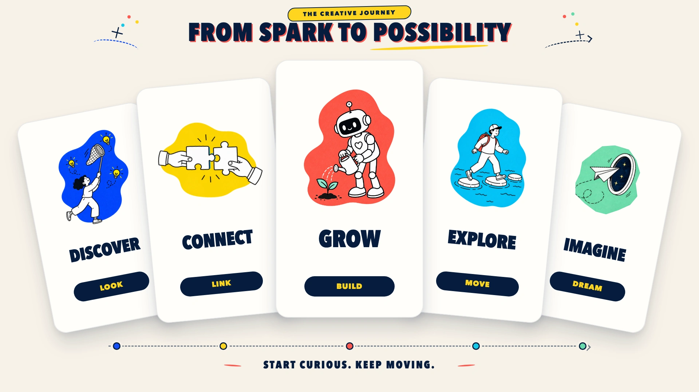
        </a>
      </details>
    </td>
    <td width="51.02%" align="center" valign="top">
      <video src="https://github.com/user-attachments/assets/8f62f0ce-97a0-4ca7-a57a-1a264b8e6872" width="100%" controls></video>
    </td>
  </tr>
</table>

<video src="https://github.com/user-attachments/assets/947462e6-9fe5-4637-af8e-bffde328b398" width="100%" controls></video>

**Prompt:**

```text
Create a polished wide 16:9 contemporary editorial poster on a clean warm-white background. At the top center, place a small irregular yellow outlined pill reading “THE CREATIVE JOURNEY”, followed by the large bold condensed navy headline “FROM SPARK TO POSSIBILITY” with a coral-red offset print shadow and loose yellow underline; surround it with only a few playful hand-drawn starbursts, colored dots, a dashed orbit and curved arrow. Below, arrange exactly five tall white rounded cards as a symmetrical overlapping fan with realistic soft floating shadows: the upright center card is largest and highest, the adjacent cards tilt slightly outward, and the outer cards tilt farther outward and sit lower. From left to right: DISCOVER shows a curious person catching glowing ideas with a butterfly net on a cobalt-blue blob, button “LOOK”; CONNECT shows two hands joining puzzle pieces on a yellow blob, button “LINK”; GROW shows a friendly robot watering a young plant on a coral-red blob, button “BUILD”; EXPLORE shows a traveler crossing water on stepping stones on a cyan blob, button “MOVE”; IMAGINE shows a paper airplane flying through a circular portal on a mint-green blob, button “DREAM”. Use loose black hand-drawn outlines, simple white characters, minimal details, saturated irregular color blobs, bold navy condensed titles and dark navy pill buttons with yellow text. Beneath the cards, add a thin navy dashed progress track with five colored nodes matching the cards and a small arrow, followed by the slogan “START CURIOUS. KEEP MOVING.” with two short coral strokes. Keep all cards fully visible and all supplied text exactly spelled; no extra text, extra cards, logos, watermarks, gradients, photorealism, dashboard elements or clutter.
```

### TC 2024

<table role="presentation" width="100%">
  <tr>
    <td width="36.75%" align="center" valign="top">
      <details open>
        <summary align="center"><strong>🖼️ final-coding-design.png</strong></summary>
        <a href="./gallery/art-design/tc-2024/final.png">
          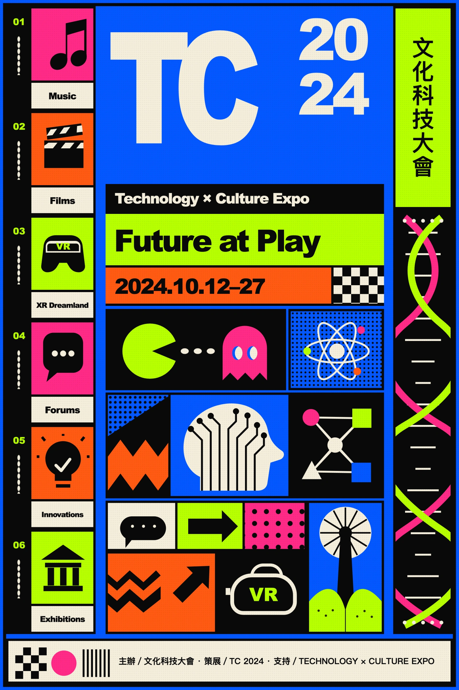
        </a>
      </details>
    </td>
    <td width="63.25%" align="center" valign="top">
      <video src="https://github.com/user-attachments/assets/a82f870b-7b63-4d52-b899-07cccec540e0" width="100%" controls></video>
    </td>
  </tr>
</table>

<video src="https://github.com/user-attachments/assets/1be9260f-c647-4529-b2b0-03363837ed9f" width="100%" controls></video>

**Prompt:**

```text
Please generate a 2:3 aspect ratio Memphis Style poster. The poster is a vibrant, grid‑style design in electric blue, neon green, magenta, and orange. It mixes tech and pop‑culture icons: a Pac‑Man and ghost, an atom symbol, a human head with circuit traces, connected nodes and shapes, arrows, speech bubbles, stylized turbines or trees, “VR” beside goggles, and a DNA double helix along the right edge.
Main text:
- TC 2024
```

<details>
<summary><strong>Show full prompt</strong></summary>

```text
Please generate a 2:3 aspect ratio Memphis Style poster. The poster is a vibrant, grid‑style design in electric blue, neon green, magenta, and orange. It mixes tech and pop‑culture icons: a Pac‑Man and ghost, an atom symbol, a human head with circuit traces, connected nodes and shapes, arrows, speech bubbles, stylized turbines or trees, “VR” beside goggles, and a DNA double helix along the right edge.

Main text:
- TC 2024
- Technology × Culture Expo
- Future at Play
- 2024.10.12–27

Program highlights listed on the left:
- Music
- Films
- XR Dreamland
- Forums
- Innovations
- Exhibitions

There is Chinese text near the middle reading “文化科技大會,” and additional organizer/sponsor credits in Chinese at the bottom. The overall look is playful and futuristic, combining geometric shapes and bright color blocks.
```

</details>

---

## Quick Start

Editable Visual Design is implemented as the `poster-building` skill. The installable skill package and a reproducible starter project are being prepared for the public release. Until then, the Gallery publishes the original prompts and rendered outcomes, with editable demonstrations and Agent Design Replays being added case by case.

## Acknowledgements

We are grateful to the open-source projects that have helped shape the public conversation around AI-native visual creation, including:

- [awesome-gpt-image](https://github.com/ZeroLu/awesome-gpt-image), whose clear prompt-and-result gallery helped inspire the presentation of this Gallery.
- [OpenDesign](https://github.com/EthanGuo2022/OpenDesign), for advancing open, agent-driven, editable visual artifacts and visible design trajectories.

And thanks to the broader open-source design and Coding Agent communities for making this work possible.
