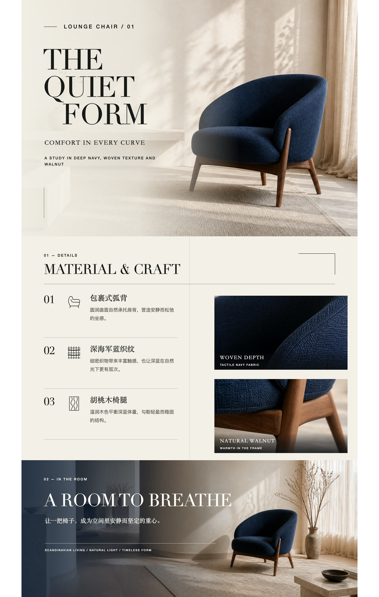
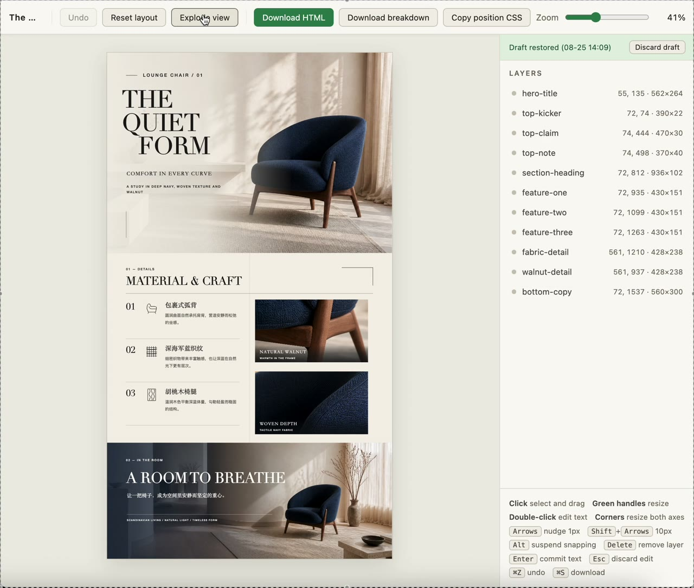
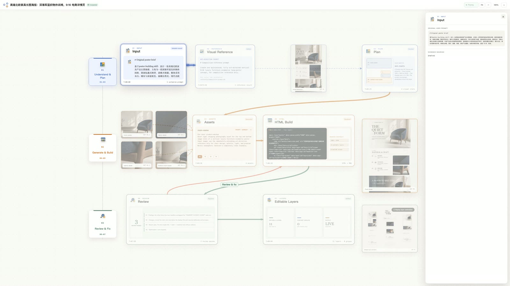

# Editable Design

Agent-driven creation of editable, tastefully crafted visual artifacts.

## Case Gallery

### Nordic Chair

A high-end Nordic furniture campaign rebuilt as an editable visual artifact with real text, independent imagery, and semantic HTML layers.

Campaigns · 1080 × 1920 · 11 editable layers · HTML + PNG

<table>
  <colgroup>
    <col width="35%">
    <col width="65%">
  </colgroup>
  <thead>
    <tr>
      <th>Final&nbsp;Coding&nbsp;Design</th>
      <th>Editable&nbsp;Display</th>
    </tr>
  </thead>
  <tbody>
    <tr>
      <td align="center" valign="top">
        
      </td>
      <td align="center" valign="top">
        
      </td>
    </tr>
  </tbody>
</table>

  

<strong>Agent&nbsp;Design&nbsp;Replay</strong>

  
<strong>Original Prompt</strong>

   
  设计一张高端北欧家具产品长图海报，主角为一把深海军蓝色织物休闲椅，圆润包裹式椅背，胡桃木椅腿。整体采用米白、暖灰与深蓝配色，温暖自然光，现代北欧客厅场景，精致家居杂志质感。海报包含：顶部大幅生活场景与品牌标题、中部产品卖点和极简线性图标、座椅面料与木质结构的细节特写、底部完整空间展示。留白充足，黑色优雅衬线字体，网格化排版，简约、温暖、高级、真实产品摄影，电商详情页风格，竖版 9:16，高清。

