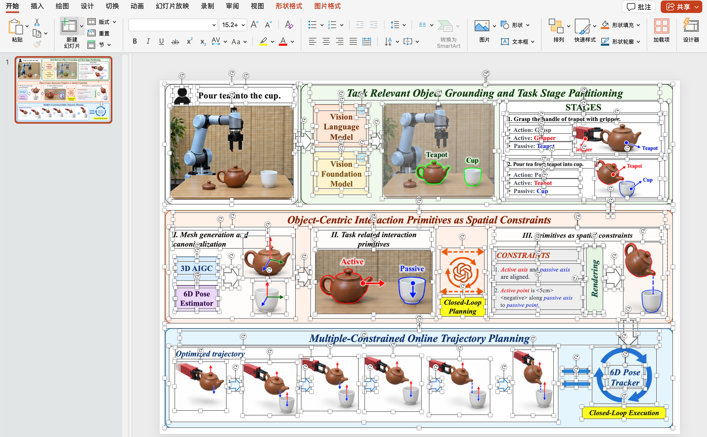
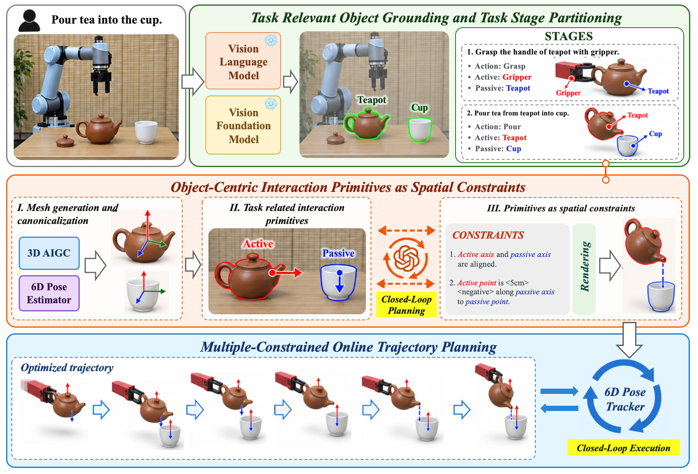
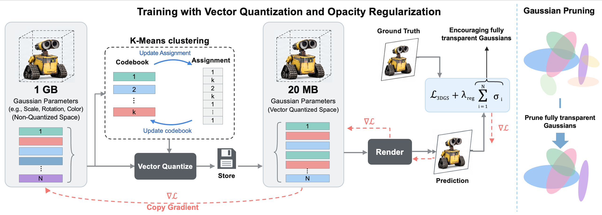
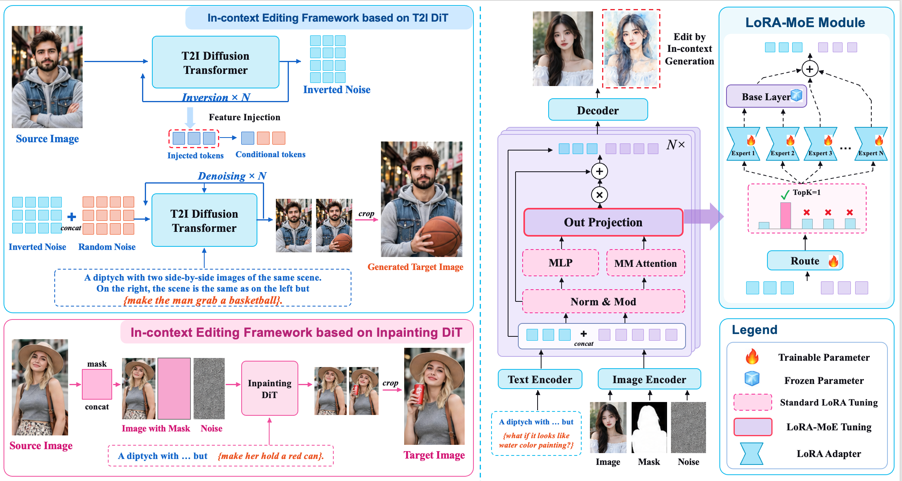

# Paper Fig

[← Editable Visual Design](../README.md) · [Skill source](../skills/paper-fig/) · [Installation guide](../skills/paper-fig/INSTALL.md)

Generate paper workflow diagrams from method descriptions in your chosen visual style, with editable text, shapes, and images in PowerPoint.

<a href="../assets/paper-fig-powerpoint.png">
  
</a>

## Install and use Paper Fig

Copy this request into Codex:

```text
Install the paper-fig Skill from:
https://github.com/yejy53/Editable-Design/tree/main/skills/paper-fig
```

Then provide a method description and your preferred visual style:

```text
Use $paper-fig to turn the following method description into a paper workflow diagram in my requested visual style. Deliver an editable PowerPoint.
```


## Examples

Research method pipelines and architecture diagrams generated with [`paper-fig`](../skills/paper-fig/). The reference cases come from [PaperGallery](https://github.com/LongHZ140516/PaperGallery) and the original papers credited below. These are qualitative examples, not a model-performance benchmark.

### OmniManip — Object-Centric Manipulation

<a href="../gallery/paper-figures/omnimanip/final.png">
  
</a>

Generated with **Paper Fig** · Reference: [PaperGallery](https://longhz140516.github.io/PaperGallery/images/pipeline-Pan_OmniManip_2025/) · [Original paper](https://arxiv.org/abs/2501.03841)

### Compact3D — Gaussian Compression

<a href="../gallery/paper-figures/compact3d/final.png">
  
</a>

Generated with **Paper Fig** · Reference: [PaperGallery](https://longhz140516.github.io/PaperGallery/images/pipeline-Navaneet_Compact3D_2024/) · [Original paper](https://arxiv.org/abs/2311.18159)

### ICEdit — In-Context Image Editing

<a href="../gallery/paper-figures/icedit/final.png">
  
</a>

Generated with **Paper Fig** · Reference: [PaperGallery](https://longhz140516.github.io/PaperGallery/images/pipeline-Zhang_ICEdit_2025/) · [Original paper](https://arxiv.org/abs/2504.20690)

[Source attribution and reuse notes](../gallery/paper-figures/NOTICE.md)
